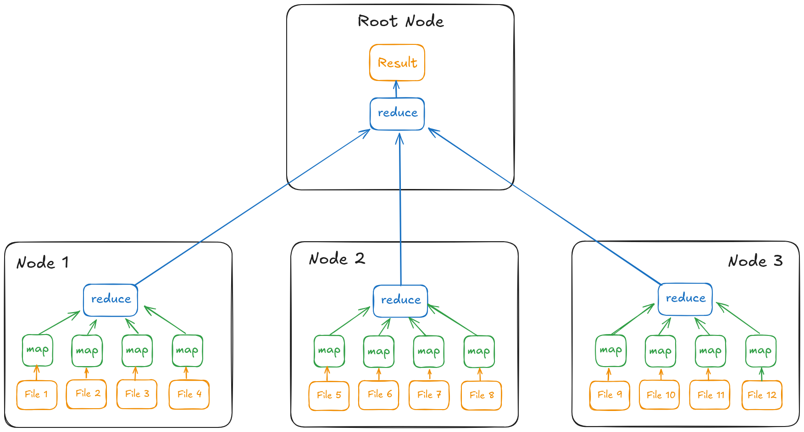

# MapReduce

Мы теперь умеем создавать потоки и передавать информацию между ними. Давайте с их помощью решим практическую задачу.


## Что такое MapReduce?

Представьте, что у нас есть много данных. Настолько много, что они не помещаются на одном компьютере, и хранятся частями на нескольких компьютерах. Это один из аттрибутов ["больших данных" (Big Data)](https://ru.wikipedia.org/wiki/%D0%91%D0%BE%D0%BB%D1%8C%D1%88%D0%B8%D0%B5_%D0%B4%D0%B0%D0%BD%D0%BD%D1%8B%D0%B5). Мы хотим эти данные не просто хранить, а извлекать из них какую-то пользу. Для этого нужно уметь как-то их обрабатывать.

Один из способов обработки больших данных -- [MapReduce](https://ru.wikipedia.org/wiki/MapReduce). Это модель распределенных вычислений над данными в кластере. Работа выполняется параллельно во много потоков на всех машинах одновременно. Название происходит от двух известных функций высшего порядка -- **map** и **reduce**. 

Потоки делятся по ролям на две группы. **Map-потоки** получают некую часть данных, вычисляют промежуточный результат над этими данными и передают их в **Reduce-потоки**. Каждый Reduce-поток собирает результаты от нескольких Map-потоков и агрегирует их. Reduce-потоки могут быть организованы в древовидную иерархию, где потоки нижнего уровня являются источником данных для следущего уровня. В конечном итоге все данные агрегируются в вершине дерева. И это является результатом всех вычислений.

В модели еще нужен координатор, который создаст иерархию Reduce-потоков и распределит все данные между Map-потоками.

Одна из популярных реализаций модели MapReduce это [Apache Hadoop](https://hadoop.apache.org/).


## Задача

Наша задача -- посчитать суммарное количество слов в списке файлов. С этой задачай вполне справляется утилита **wc**:

```shell
$ wc -w *.md
  874 10_01_processes.md
  643 10_02_mailbox.md
 1161 10_03_link.md
  324 10_04_monitor.md
  508 10_05_map_reduce.md
 3510 total
```

Но wc работает последовательно в одном потоке. Мы же хотим ускорить вычисление и обработать все файлы одновременно. Поэтому мы запустим отдельный процесс для каждого файла. Это будет Map-процесс. Он прочитает файл с диска, разделит его на слова и посчитает количество слов. 

Затем нам нужны Reduce-процессы, чтобы собрать и суммировать данные от всех Map-процессов. Мы запустим дерево из трех Reduce-процессов: корневой и два дочерних. У каждого дочернего Reduce-процесса будет по два Map-процесса.



```
- root_reducer
  - r1 reducer
    - w1 mapper
    - w2 mapper
  - r2 reducer
    - w3 mapper
    - w4 mapper
```

TODO подход снизу вверх, изолировано показать работу одного map и одного reduce.

Запускаем код:

```elixir-iex
iex(1)> c "lib/map_reduce.exs"
iex(2)> alias alias Map_ReduceExample, as: MR
iex(3)> MR.start()
start reducer 'root_reducer' with childs [:r1, :r2]
start reducer 'r1' with childs [:w1, :w2]
start mapper 'w1' with file './10_01_processes.md'
start mapper 'w2' with file './10_02_mailbox.md'
start reducer 'r2' with childs [:w3, :w4]
start mapper 'w3' with file './10_03_link.md'
start mapper 'w4' with file './10_04_monitor.md'
reducer r1 got result 872 from w1
reducer r1 got result 644 from w2
reducer root_reducer got result 1516 from r1
reducer r2 got result 1162 from w3
reducer r2 got result 325 from w4
reducer root_reducer got result 1487 from r2
{:ok, 3003}
```

При таком количестве данных -- 4 небольших файла, последовательное выполнение в одном процессе может оказаться быстрее. Потому что в MapReduce системе есть накладные расходы на запуск процессов и копирование данных. Но с ростом данных на каком-то этапе MapReduce становится выгоднее. А когда данные не помещаются на одном компьютере и распределяются по кластеру, последовательная обработка точно проиграет распределенной обработке.
